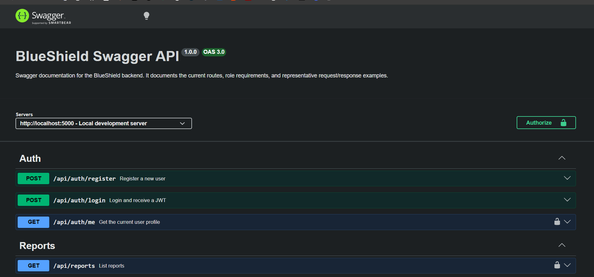

# BlueShield – Life Below Water

SE3040: Application Frameworks Team Project

## Project Overview

BlueShield is a full stack web application designed to help fishermen and authorities report, track, and manage illegal fishing activities and marine hazards. The platform supports secure reporting, case management, enforcement, and marine safety, with real-time data and external API integrations. The system is inspired by the need for sustainable marine resource management and protection of local fishing communities.

## Key Features

- Incident reporting and categorization (illegal fishing, hazards)
- Case management and review workflows
- Enforcement actions and AI-powered risk scoring
- Marine hazard and restricted zone management
- User authentication and role-based access control
- Analytics and dashboards for users and admin
- Integration with external APIs (Mapbox, Vessel Data, Open-Meteo, Gemini)
- Responsive React frontend with state management

## Architecture Overview

**Tech Stack:**

- Backend: Node.js + Express.js
- Frontend: React.js (functional components, Hooks)
- Database: MongoDB
- State Management: Context API (or Redux)
- Styling: Tailwind CSS / Bootstrap
- Deployment: Backend → Render/Railway, Frontend → Vercel/Netlify
- Testing: Jest, Supertest, Artillery

**Architecture Diagram:**

   [Frontend React App] --> REST API --> [Backend Express.js] --> [MongoDB Database]
         |                 |                |
      Context API/Redux   Routes/Controllers   Collections for:
         |                 |                |
      Components           Services/Logic      Reports, Cases, Enforcements, Hazards, Users

## Core Components & Responsibilities

### Incident & Auth Components
- User registration, login, JWT authentication
- Incident report CRUD (illegal fishing, hazards)
- Mapbox API for geolocation

### Case Review & Escalation
- Illegal case CRUD and review
- Vessel Data API simulation using Beeceptor for jurisdiction
- Bulletins and case status updates

### Enforcement & Risk Scoring
- Enforcement record CRUD
- Google Gemini API for AI risk scoring
- Action logging and status management

### Hazard & Marine Safety
- Hazard CRUD and status management
- Open-Meteo API for live sea conditions
- Restricted zone CRUD and updates

## Project Structure

---


## Quick Start

1. **Clone the repository:**
   ```bash
   git clone <[text](https://github.com/Malindup2/BlueShield)>
   cd BlueShield
   ```
2. **Install dependencies:**
   ```bash
   cd backend
   npm install
   ```
3. **Set up environment variables:**
   - Copy `.env.template` to `.env` and fill in your values:
     ```bash
     cp .env.template .env
     # Edit .env as needed
     ```
4. **Start the backend server:**
   ```bash
   npm run dev
   # or for production
   npm start
   ```
5. **Base URL:**
   - Local: `http://localhost:5000/api`
   - Production: `[Insert Render URL Here]`

---


## Project Structure

```
backend/
  src/
    config/         # DB and config files
    controllers/    # Route logic
    middlewares/    # Express middlewares
    models/         # Mongoose models
    routes/         # Express routers
    services/       # Business logic
    utils/          # Utility functions
  .env.template     # Example environment variables
  .gitignore        # Ignore sensitive and build files
  server.js         # Main entry point
frontend/
  ...               # React app (see frontend/README.md)
```

---


## Authentication
All protected routes require a JWT in the `Authorization` header:

   Authorization: Bearer <your_jwt_token>

---


## API Components & Endpoints

### API Reference

The complete, interactive API documentation is available at:
**[https://blueshield-kixw.onrender.com/api-docs](https://blueshield-kixw.onrender.com/api-docs)**

The README keeps the human-readable route summary below so each endpoint is clear at a glance.

### 1. Auth & Session Management

#### `POST /api/auth/register`
Registers a new user account and returns a JWT for immediate login.

#### `POST /api/auth/login`
Authenticates a user with email and password and returns the user profile plus token.

#### `GET /api/auth/me`
Returns the currently authenticated user profile.

### 2. Reports

#### `POST /api/reports`
Creates a new incident report with title, description, type, severity, and optional location data.

#### `GET /api/reports`
Lists reports for authorized users so they can review submitted incidents.

#### `GET /api/reports/:reportId`
Fetches the details of one report by its ID.

#### `PATCH /api/reports/:reportId`
Updates an existing report with new information, such as status or extra details.

#### `DELETE /api/reports/:reportId`
Deletes a report record after authentication and application-level ownership checks.

### 3. Illegal Case Review & Escalation

#### `GET /api/illegal-cases/reports/pending`
Returns reports that are waiting for illegal-case review.

#### `PATCH /api/illegal-cases/reports/:reportId/mark-reviewed`
Marks a submitted report as reviewed.

#### `DELETE /api/illegal-cases/reports/:reportId`
Removes a reviewed report entry from the illegal-case workflow.

#### `GET /api/illegal-cases/officers`
Loads the officer list so administrators can assign a case.

#### `POST /api/illegal-cases/reports/:reportId/review`
Creates a new illegal case record from a report after review.

#### `GET /api/illegal-cases`
Lists all illegal case records for the illegal-admin dashboard.

#### `GET /api/illegal-cases/:caseId`
Returns the details of a single illegal case.

#### `PATCH /api/illegal-cases/:caseId`
Updates an existing illegal case record.

#### `DELETE /api/illegal-cases/:caseId`
Deletes an illegal case record.

#### `POST /api/illegal-cases/:caseId/escalate`
Escalates the case to a selected officer.

#### `POST /api/illegal-cases/:caseId/resolve`
Marks an illegal case as resolved.

#### `POST /api/illegal-cases/:caseId/track`
Triggers vessel tracking data for the case.

#### `POST /api/illegal-cases/:caseId/notes`
Adds a reference note or follow-up note to the case.

### 4. Enforcement Workflow

#### `GET /api/enforcements/stats/basic`
Returns a basic enforcement summary for the dashboard.

#### `GET /api/enforcements/stats/by-date`
Returns enforcement metrics filtered by date range.

#### `GET /api/enforcements/team/officers`
Lists active officers who can be assigned to an enforcement.

#### `POST /api/enforcements`
Creates a new enforcement record for an illegal case.

#### `GET /api/enforcements`
Lists enforcement records for officers, system admins, and illegal admins.

#### `GET /api/enforcements/:enforcementId`
Fetches one enforcement record with its linked case and officer details.

#### `PATCH /api/enforcements/:enforcementId`
Updates the enforcement record.

#### `DELETE /api/enforcements/:enforcementId`
Deletes the enforcement record.

#### `POST /api/enforcements/from-case/:caseId`
Creates a new enforcement directly from an illegal case.

#### `POST /api/enforcements/:enforcementId/actions`
Adds a logged enforcement action such as a warning, arrest, seizure, or fine.

#### `PATCH /api/enforcements/:enforcementId/actions/:actionId`
Updates a previously logged enforcement action.

#### `DELETE /api/enforcements/:enforcementId/actions/:actionId`
Removes a logged enforcement action.

#### `PATCH /api/enforcements/:enforcementId/close`
Closes the enforcement and stores the final outcome, penalty, and notes.

#### `POST /api/enforcements/:enforcementId/risk-score`
Generates an AI risk score using the Gemini integration.

#### `GET /api/enforcements/:enforcementId/evidence`
Lists all evidence items attached to the enforcement.

#### `POST /api/enforcements/:enforcementId/evidence`
Uploads a new evidence item and its attachment data.

#### `PATCH /api/enforcements/:enforcementId/evidence/:evidenceId`
Updates an existing evidence item and any new uploaded files.

#### `DELETE /api/enforcements/:enforcementId/evidence/:evidenceId`
Deletes an evidence item and removes linked Cloudinary files.

#### `GET /api/enforcements/:enforcementId/team`
Lists the enforcement team members assigned to the case.

#### `POST /api/enforcements/:enforcementId/team`
Assigns an officer or team member to the enforcement.

#### `PATCH /api/enforcements/:enforcementId/team/:memberId`
Updates a team member's status, role, hours, or responsibilities.

#### `DELETE /api/enforcements/:enforcementId/team/:memberId`
Removes a team member from the enforcement.

### 5. Hazard & Marine Safety

#### `POST /api/hazards/from-report/:reportId`
Creates a verified hazard record from an approved report.

#### `GET /api/hazards`
Lists all hazard records for hazard-admin users.

#### `GET /api/hazards/:id`
Fetches one hazard record by ID.

#### `PATCH /api/hazards/:id`
Updates the hazard details or handling status.

#### `GET /api/hazards/:id/weather`
Fetches live sea or weather conditions for the hazard location.

#### `PATCH /api/hazards/:id/resolve`
Marks the hazard as resolved and disables linked active zones.

#### `DELETE /api/hazards/:id`
Deletes a hazard record permanently.

### 6. Zones

#### `POST /api/zones`
Creates a restricted or dangerous zone linked to a hazard.

#### `GET /api/zones`
Lists zones in a format suitable for map display.

#### `GET /api/zones/:id`
Fetches one zone by ID.

#### `PATCH /api/zones/:id`
Updates zone details or disables the zone.

#### `DELETE /api/zones/:id`
Deletes the zone permanently.

---


## Environment Variables
See `.env.template` for all required variables:

   PORT=5000
   NODE_ENV=development
   MONGO_URI=your_mongodb_connection_string
   JWT_SECRET=your_jwt_secret

---


## Contributing
- Fork and clone the repo
- Create a new branch for your feature/component
- Commit and push your changes
- Open a pull request

---


## License
MIT

---


## External APIs Used
- Mapbox Reverse Geocoding
- Beeceptor API (for simulating vessel tracking)
- Google Gemini API
- Open-Meteo Marine API
- DataDocked VesselFinder API
- MyShipTracking API
- Position API (vessel position microservice)
- Cloudinary (image uploads)
- Azure Translator API

## Notes
- Do NOT commit `.env` or `.env.local` files.
- DO commit `.env.template` for onboarding new developers.
- See API docs above for endpoint details and required roles.
 
###  Detailed Documentation
For full compliance with the SE-3040 project requirements, please refer to the following detailed reports:
- **[Testing Instruction Report](./Testing_Instruction_Report.md)**: Detailed guide for Unit, Integration, and Performance testing.
- **[Deployment Report](./Deployment_Report.md)**: Complete architecture, setup steps, and evidence.

---

## Deployment Documentation

This application is deployed using a decoupled architecture with the backend on Render and the frontend on Vercel.

###  Backend Deployment (Render)
The Node.js/Express API is hosted on **Render**.

**Setup Steps:**
1.  **Create Service**: Create a new "Web Service" on Render and connect the GitHub repository.
2.  **Root Directory**: Set the root directory to `./backend`.
3.  **Build Command**: Set the build command to `npm install`.
4.  **Start Command**: Set the start command to `npm start`.
5.  **Environment Variables**: Add all required variables (see below) in the Render dashboard "Environment" section.

**Live Backend API URL:** [https://blueshield-kixw.onrender.com](https://blueshield-kixw.onrender.com)

---

###  Frontend Deployment (Vercel)
The React application is hosted on **Vercel**.

**Setup Steps:**
1.  **Import Project**: Import the repository into the Vercel dashboard.
2.  **Root Directory**: Set the root directory to `./frontend`.
3.  **Framework Preset**: Select **Vite**.
4.  **Environment Variables**: Ensure `VITE_API_BASE_URL` is set to point to the Render backend URL.
5.  **Deploy**: Trigger the deployment.

**Live Frontend Application URL:** [https://blue-shield-ivory.vercel.app](https://blue-shield-ivory.vercel.app)

---

###  Environment Variables
The following environment variables are required for the system to function. Do **not** expose actual secrets in the repository.

# Server
PORT=5000
NODE_ENV=development
ALLOWED_ORIGIN=https://blue-shield-ivory.vercel.app

# MongoDB
MONGO_URI=mongodb+srv://<username>:<password>@cluster0.mongodb.net/blueshield

# Authentication
JWT_SECRET=your_jwt_secret_here
JWT_EXPIRE=7d

# Google Gemini AI
GEMINI_API_KEY=your_gemini_api_key_here

# Mapbox
MAPBOX_API_KEY=your_mapbox_api_key_here

# ---- Vessel Tracking APIs (fallback chain) ----

# 1. DataDocked VesselFinder API (primary)
DATADOCKED_API_KEY=your_datadocked_api_key_here

# 2. MyShipTracking API (secondary fallback)
MYSHIPTRACKING_API_KEY=your_myshiptracking_api_key_here
MYSHIPTRACKING_BASE_URL=https://api.myshiptracking.com

# 3. Beeceptor Mock Vessel API (tertiary fallback)
BEECEPTOR_VESSEL_API_URL=https://blueshield-vessels.free.beeceptor.com/api/vessels

# Position API (vessel position microservice)
POSITION_API_BASE_URL=http://localhost:5050
POSITION_API_TIMEOUT_MS=15000

# Cloudinary (image uploads)
CLOUDINARY_CLOUD_NAME=your_cloud_name_here
CLOUDINARY_API_KEY=your_cloudinary_api_key_here
CLOUDINARY_API_SECRET=your_cloudinary_api_secret_here

# Azure Translator (multilingual support)
AZURE_TRANSLATOR_KEY=your_azure_translator_key_here
AZURE_TRANSLATOR_LOCATION=eastasia
AZURE_TRANSLATOR_ENDPOINT=https://api.cognitive.microsofttranslator.com/

---

###  Deployment Evidence
*Evidence of successful deployment and operational status.*

> **Dashboard Status:** 

  Vercel

  

  

  Render

  

  

> **Live API Response:**

  

> **Mobile/Web View:** 
  

### Testing Instructions
For comprehensive testing instructions, including Unit, Integration, and Performance testing setup and execution, please refer to the **[Testing Instruction Report](./Testing_Instruction_Report.md)**.

## Best Practices
- Use a single `.gitignore` at the root; do NOT commit `.env` or `.env.local`
- Commit `.env.template` for onboarding
- Use meaningful commit messages and regular pushes
- Follow clean architecture: controllers, services, models, routes, utils
- Validate and sanitize all inputs
- Handle errors and edge cases gracefully
