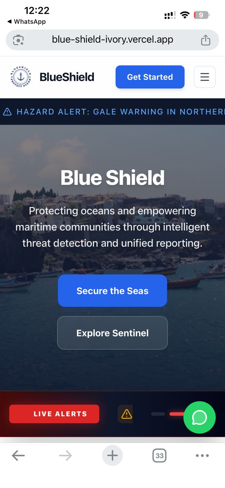

# Deployment Report

This report documents the cloud deployment architecture and setup steps for the BlueShield full-stack system, in accordance with the SLIIT SE-3040 project requirements.

---

## 1. System Architecture

BlueShield follows a decoupled client-server architecture:
- **Client (Frontend)**: Deployed on **Vercel** for high-performance static hosting and automatic SSL.
- **API (Backend)**: Deployed on **Render** (as a Web Service) to handle dynamic business logic and database orchestration.
- **Database**: Hosted on **MongoDB Atlas** (Cloud Database-as-a-Service).

---

## 2. Backend Deployment (Render)

- **Platform**: Render (Web Service)
- **Deployment Strategy**: Continuous Deployment from GitHub `main` branch.
- **Setup Steps**:
  1.  Create a "Web Service" on the Render Dashboard.
  2.  Root Directory: `./backend`
  3.  Build Command: `npm install`
  4.  Start Command: `npm start`
  5.  Environment Variables: Configured via the Render Dashboard "Environment" tab.

### Backend Environment Variables (Confidential)
  - Server
    - PORT=5000
    - NODE_ENV=development
    - ALLOWED_ORIGIN=https://blue-shield-ivory.vercel.app

  - MongoDB
    - MONGO_URI=mongodb+srv://<username>:<password>@cluster0.mongodb.net/blueshield

  - Authentication
    - JWT_SECRET=your_jwt_secret_here
    - JWT_EXPIRE=7d

  - Google Gemini AI
    - GEMINI_API_KEY=your_gemini_api_key_here

  - Mapbox
    - MAPBOX_API_KEY=your_mapbox_api_key_here

  - Vessel Tracking APIs (fallback chain)
    - DataDocked VesselFinder API (primary)
    - DATADOCKED_API_KEY=your_datadocked_api_key_here

  - MyShipTracking API (secondary fallback)
    - MYSHIPTRACKING_API_KEY=your_myshiptracking_api_key_here
    - MYSHIPTRACKING_BASE_URL=https://api.myshiptracking.com

  - Beeceptor Mock Vessel API (tertiary fallback)
    - BEECEPTOR_VESSEL_API_URL=https://blueshield-vessels.free.beeceptor.com/api/vessels

  - Position API (vessel position microservice)
    - POSITION_API_BASE_URL=http://localhost:5050
    - POSITION_API_TIMEOUT_MS=15000

  - Cloudinary (image uploads)
    - CLOUDINARY_CLOUD_NAME=your_cloud_name_here
    - CLOUDINARY_API_KEY=your_cloudinary_api_key_here
    - CLOUDINARY_API_SECRET=your_cloudinary_api_secret_here

  - Azure Translator (multilingual support)
    - AZURE_TRANSLATOR_KEY=your_azure_translator_key_here
    - AZURE_TRANSLATOR_LOCATION=eastasia
    - AZURE_TRANSLATOR_ENDPOINT=https://api.cognitive.  microsofttranslator.com/
---

## 3. Frontend Deployment (Vercel)

- **Platform**: Vercel
- **Setup Steps**:
  1.  Import GitHub repository to Vercel.
  2.  Root Directory: `./frontend`
  3.  Framework Preset: **Vite**
  4.  Environment Variables: `VITE_API_BASE_URL` pointing to the Render backend.

---

## 4. Live URLs

- **Deployed Backend API**: [https://blueshield-kixw.onrender.com](https://blueshield-kixw.onrender.com)
- **Deployed Frontend Application**: [https://blue-shield-ivory.vercel.app](https://blue-shield-ivory.vercel.app)
- **Interactive API Documentation (Swagger)**: [https://blueshield-kixw.onrender.com/api-docs](https://blueshield-kixw.onrender.com/api-docs)

---

## 5. Deployment Evidence

*Below are placeholders for visual proof of deployment. Students must replace these with actual screenshots from their dashboards.*

### Render Dashboard (Backend)

*Evidence of backend web service status: "Live"*

### Vercel Dashboard (Frontend)
 

 

*Evidence of frontend deployment success.*

### Live API Response (Swagger UI)

*Evidence of operational API endpoints.*

### Mobile Responsiveness Evidence

*Visual confirmation of responsive UI for field operations.*
